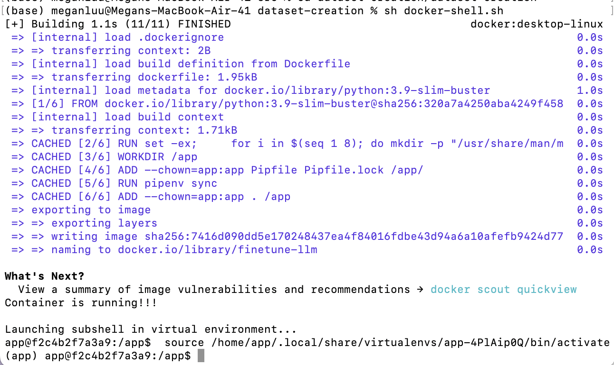
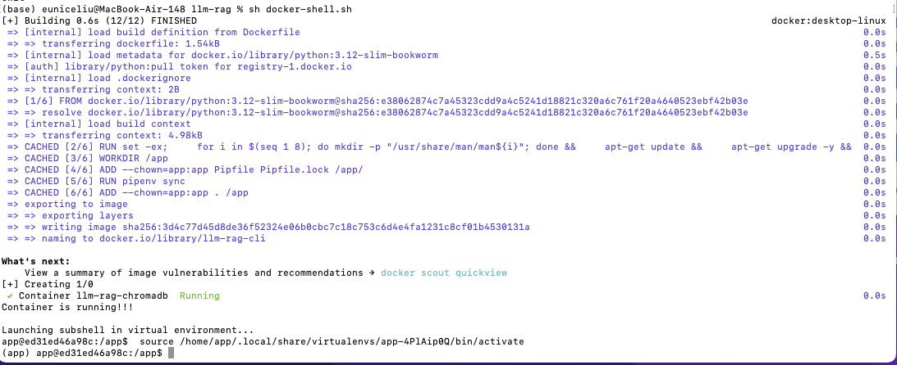
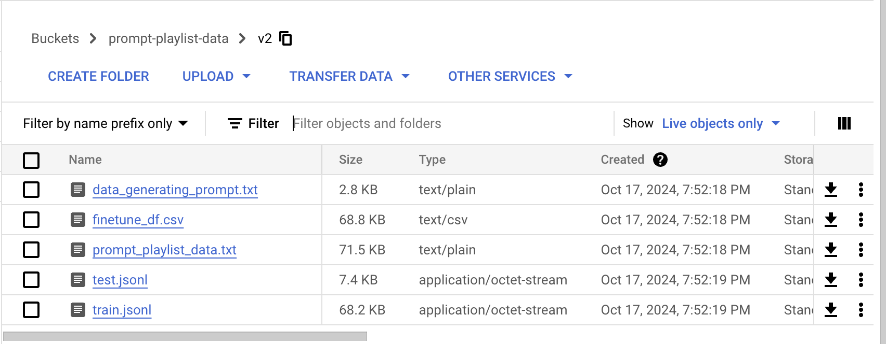
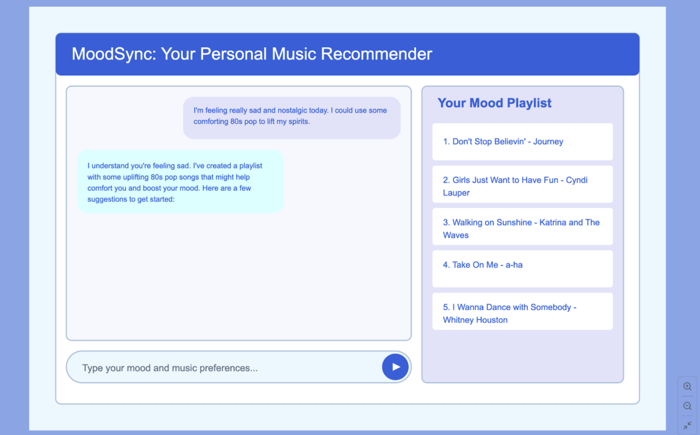

# AC215 - Milestone2 - MoodSync: AI-Powered Playlists for Emotional Resonance

## Project Information
**Team Members**
Eunice Liu (youchiliu@fas.harvard.edu)
Megan Luu (meganluu@g.harvard.edu)
Xinyu Chen (xinyuchen@hms.harvard.edu)

**Group Name**
MoodSync Group

**Description**
In this project, we aim to develop an AI-powered music recommendation tool. The tool will feature a chatbot designed to analyze text input from users about their current mood and music preferences, such as favorite artists and genres. Users can input descriptions of their feelings and musical tastes, and the chatbot will generate a personalized playlist tailored to their emotional state and preferences. It will be powered by a RAG model and fine-tuned models, making it a specialist in personalized music playlist curation.

**Overview of this Milestone**
For this milestone, we implemented and documented virtual environments for containerized components by docker containers for each project component (e.g., data scraping, preprocessing). We also experimented a data versioning strategy using tools like DVC. Besides, we set up a RAG (Retrieval-Augmented Generation) workflow including data collection, chunking, and vector database integration and fine-tuned models and document the process. Lastly, we developed and refined a prototype of the final application.


## Data
1. The Genius Expertise Dataset consists of public user and song information from [genius.com](https://genius.com/), focusing on song lyrics, annotations, and artists informations. Collected through web crawls from September 2019 to January 2020, this dataset includes annotations of the lyrics from users and artists that can be valuable for building the RAG model by leveraging the insights and interpretations embedded in the annotations. The dataset was cited as follows: Lim, Derek, and Austin R. Benson. "Expertise and Dynamics within Crowdsourced Musical Knowledge Curation: A Case Study of the Genius Platform." Proceedings of the International Conference on Web and Social Media (ICWSM), 2021. The data file can be accessed [here](https://github.com/cptq/genius-expertise/tree/master/data). We obtained the lyrics, annotations, and song informations data, which can significantly enhance the understanding of lyrical interpretations and user contributions, making it a useful resource for research and model development in music annotation and analysis. We stored the dataset in our private Google Cloud Platform bucket.
2. The [Spotify Million Playlist](https://www.aicrowd.com/challenges/spotify-million-playlist-dataset-challenge) dataset consists of user-generated playlists with titles & descriptions. The titles and descriptions often refer to music categories (genre, artist, year, etc.), mood, themes, or occasions. Thus, we experimented with this dataset in fine-tuning to allow the LLM to better learn associations between playlist content and music categories/moods. To understand the preprocessing steps before we used the data for fine-tuning, please refer to the dataset-creation [documentation](src/dataset-creation).
3. LLM-Generated Prompt-Response pairs were generated using carefully curated prompt instructions to target areas of performance improvement in the playlist recommendations. Specifically, this dataset contains example prompts that utilize modern day slang, as well as vague prompts that do not explicitly ask for playlists. This dataset was also used in fine-tuning experimentation to allow the LLM to better learn a preferred output format and persona. To understand the complete data generation and preprocessing steps for this dataset, please refer to the dataset-creation [documentation](src/dataset-creation).


## Virtual Environment Setup
Each component of the project is uniquely containerized such that they each have their own tailored virtual environment with the packages and installations required to perform its processes. These environments were created using `pipenv` to generate `Pipfile` and `Pipfile.lock` that included the necessary packages. Then, the Dockerfile tells the system to install the packages based on the `Pipfile.lock`, ensuring that the container environment has all the dependencies needed. Finally, `docker-shell.sh` sets up variables used for GCP credentials, builds the Docker image, and runs the container. 

### Summary of Containers
1. The container in dataset-creation generates Prompt-Playlist pairs based on Spotify playlist data or LLM-generated information. It then prepares the data in a JSONL format that can be used to fine-tune LLMs, and uploads the files to a specified version folder in the GCS bucket.

2. The container in finetune-llm enables fine-tuning of the model, as well as chatting with the foundation model and fine-tuned model.

3. The container in datapipeline prepares data for the RAG model, including tasks such as chunking, embedding, and populating the vector database. It also include a sample queries into the database to check if the database is created successfully.


### Running Containers
Below are examples of running containers for different parts of the project:

- **Dataset Creation**:
  

- **Preprocessing RAG**:
  


## Versioned Data Strategy

For Milestone 2, we experimented with dvc and GCS bucket versioning. We ultimately decided on using GCS bucket versioning for simplicity because our datasets were relatively small and our changes to the datasets would be quite infrequent. The GCS versioning was most straightforward to integrate in our workflow because we already had a pipeline for referring to the data files in the GCS bucket when fine-tuning the LLM. However, for future milestones, we may consider implementing dvc if our dataset requires scaling. 


Here, we store V2 of our fine-tuning dataset in the GCS prompt-playlist-data bucket. This version contains the .jsonl files used to fine-tune the LLM, the raw text outputted from the LLM used to generate the data in prompt_playlist_data.txt, the finetune_df.csv file containing the prompt-playlist pairs, and the system instructions used to instruct the LLM on how to generate the data. V1 of the data can correspondingly be found in the v1 folder of the GCS prompt-playlist-data bucket. 

## Data Pipeline Overview

1.**`src/dataset-creation/dataset-creation/cli.py`**
   This script performs the data generation and uploads the collected data into the google bucket.
   
2.**`src/finetune-llm/finetune-llm/cli.py`**
   This script performs the communication with the foundation models, adjusting prompting, and fine-tuning of LLM models.
   
3.**`src/datapipeline/preprocess_rag.py`**
   This script prepares the necessary data for setting up our vector database. It performs chunking, embedding, and loads the data into a vector database (ChromaDB). It also include a querying function to test if our database is created successfully or not.

## LLM Experiments
**LLM RAG Experiments**
1. Within the datapipeline folder, the containers built from running docker-shell.sh performes chunking, embedding, loading, query, and chatting for the dataset. 
2. Attempts at preliminary RAG experimentation with semantic chunking, different temperatures, different prompts, and different chatting content retrieved from RAG search can be found at [this google sheets](https://docs.google.com/spreadsheets/d/1y8O647Cm27uGKXFjlYm7Tbsdz7yxjr2rYflDZmshVo4/edit?usp=sharing). 

**LLM Finetuning Experiments**
1. Within the finetune-llm folder, the container built from running docker-shell.sh performs communication with different foundation LLM models as well as fine-tuning of the models with various epochs. The preliminary experiments by adjusting different models, different epochs, and different prompts for finetuning can be found on the same [google sheets](https://docs.google.com/spreadsheets/d/1y8O647Cm27uGKXFjlYm7Tbsdz7yxjr2rYflDZmshVo4/edit?usp=sharing). 

## Running Dockerfile

To run Dockerfile - in the respective folders where the .sh scripts are located, run `sh docker-shell.sh`

**Model containers: src/dataset-creation, src/finetune-llm, src/datapipeline**
- These containers have scripts for data creation, model training, and rag pipeline and inference

**Notebooks/Reports**
- The reports and notebooks folder contain code that is not part of container. The 'reports' folder contains the project proposal from Milestone 1. The 'notebooks' folder contains EDA on the Genius lyrics dataset that was utilized for the RAG documents, as well as a notebook for data preprocessing of the Spotify fine-tuning data.

## Application Mock-Up



## Directory

```
├── Readme.md
├── LICENSE
├── results
│   └── experiments
│   └── images
├── notebooks
│   └── eda.ipynb
│   └── finetunedata_preprocessing.ipynb
├── reports
│   └── MoodSync_Proposal.pdf
└── src
    ├── dataset-creation
    │   ├── env.dev
    │   ├── dataset-creation
    │   │   ├── cli.py
    │   │   ├── docker-entrypoint.sh
    │   │   ├── docker-shell.sh
    │   │   ├── Dockerfile
    │   │   ├── Pipfile
    │   │   ├── Pipfile.lock
    │   │   └── spotify_playlist_data.csv
    ├── data-versioning
    │   ├── docker-entrypoint.sh
    │   ├── docker-shell.sh
    │   ├── Dockerfile
    │   ├── Pipfile
    │   ├── Pipfile.lock
    │   ├── promptdata.csv.dvc
    │   └── prompts.txt.dvc
    ├── finetune-llm
    │   ├── env.dev
    │   ├── finetune-llm
    │   │   ├── cli.py
    │   │   ├── docker-entrypoint.sh
    │   │   ├── docker-shell.sh
    │   │   ├── Dockerfile
    │   │   ├── Pipfile
    │   │   └── Pipfile.lock
    ├── datapipeline
    │   ├── docker-entrypoint.sh
    │   ├── docker-shell.sh
    │   ├── Dockerfile
    │   ├── Pipfile
    │   ├── Pipfile.lock
    │   ├── semantic_splitter.py
    │   ├── preprocess_rag.py
    │   └── docker-compose.yml
    └── secrets

```
----
