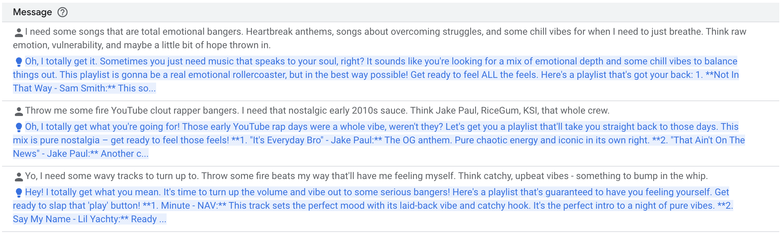
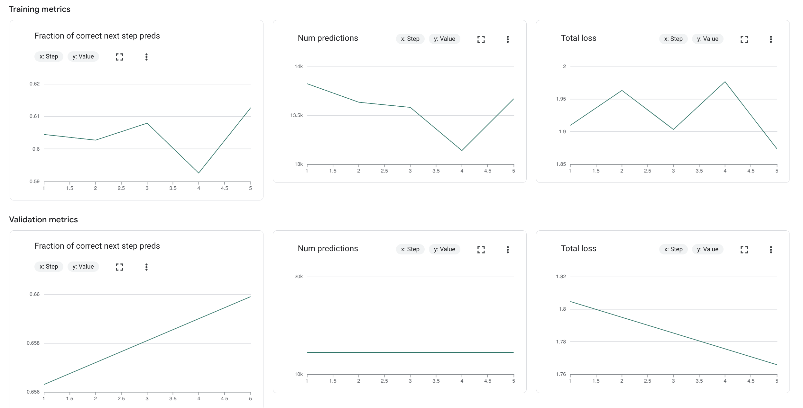
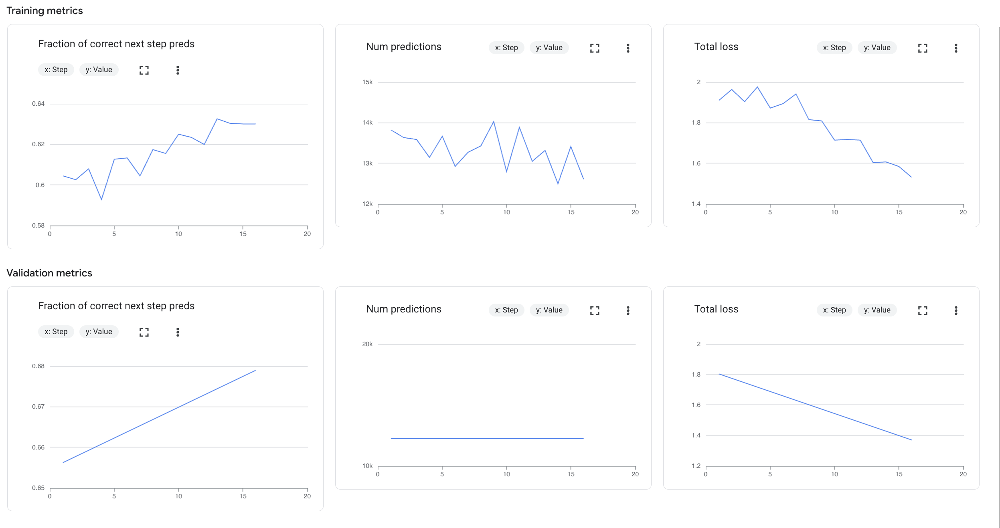
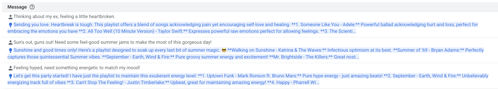
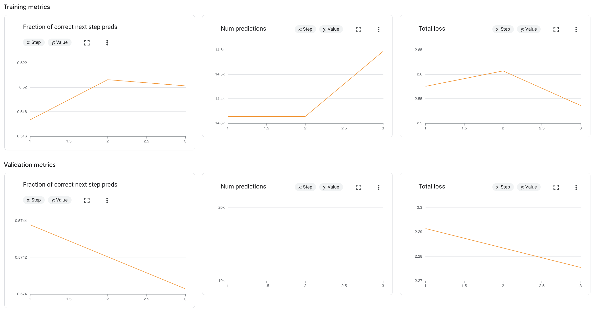
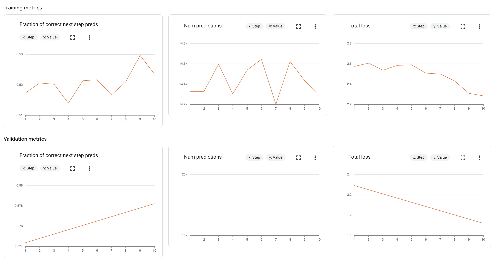
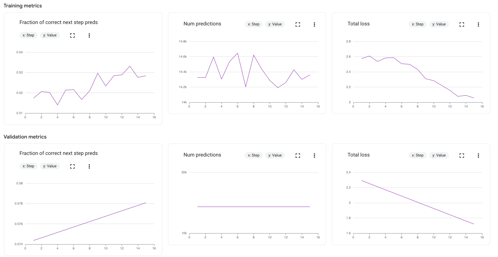

# LLM Fine-Tuning Experiments
Through experimenting with the foundation model, we found that the LLM sometimes struggled to provide playlist recommendations with prompts containing slang and prompts that do not explicitly ask for a playlist. Furthermore, the formatting of the responses had high variability and playlists for different prompts often still included similar songs. Thus the goal of fine-tuning was to improve the LLM's responses to slang and vague prompts, improve the quality of the song recommendations, and improve the consistency in formatting and tone in the responses.

## Using the Spotify playlist dataset
First, we experimented with fine-tuning the LLM on the Prompt-Playlist pair dataset generated from the Spotify playlist data. This data consists of 50 prompt-playlist pairs where the playlist content consists of real user-generated playlists, and the prompt is LLM-generated based on the user-generated title and description. 
Here is a sample from the dataset:

The LLM was fine-tuned using `adapter size=4`, `learning_rate_multiplier=1`, for 3 epochs and 10 epochs, and the tuning metrics from GCP are displayed here:
| Number of Epochs  | Tuning Metrics   |
| ----------- | ----------- |
| 3 ||
| 10 | |

Through examination of the tuning metrics, the lack of improvement in the training loss with 3 epochs suggested that 3 epochs was insufficient in improving the model. Preliminary chats with the 3 epoch fine-tuned model further proved this point as the fine-tuned model had essentially the same responses as the foundation model. 

Therefore, only the 10 epoch fine-tuned model was considered for subsequent model comparisons. 

## Using the LLM-generated dataset
Next, we experimented with fine-tuning on LLM-generated Prompt-Playlist data. This data consists of 68 prompt-playlist pairs where both the prompt and responses were LLM-generated using specific instructions. Here is a sample from the dataset:

The LLM was fine-tuned using `adapter size=4`, `learning_rate_multiplier=1`, for 3, 10 and 15 epochs, and the tuning metrics from GCP are displayed here:
| Number of Epochs  | Tuning Metrics   |
| ----------- | ----------- |
| 3 ||
| 10 | |
| 15 |  |

Similar to the Spotify-generated data fine-tuning, it appears that 3 epochs was insufficient in improving the model based on the training loss logs. Again, preliminary chats with the 3 epoch model supported this conclusion as the fine-tune model responses were very similar to the foundation model. Thus we only included the 10 epoch and 15 epoch models for model comparisons.

## Model Comparisons and Conclusions
We compared the model outputs using various prompts in this [spreadsheet](https://docs.google.com/spreadsheets/d/1y8O647Cm27uGKXFjlYm7Tbsdz7yxjr2rYflDZmshVo4/edit?gid=1676036235#gid=1676036235), but here is an example: 

| Prompt  | Foundation Model | Spotify Data, 10 epochs | LLM-Generated Data, 10 epochs | LLM-Generated Data, 15 epochs |
| ----------- | ----------- | ----------- | ----------- | ----------- |
| I'm feeling pumped on caffeine. Help me chill out with some calming music. I'm into Mac Miller songs |"Given your love for Mac Miller and your need to chill out from a caffeine buzz, I'd suggest focusing on his more mellow and laid-back tracks.  Here are a few suggestions, categorized for easier browsing: **For a relaxed vibe:**  **""REMember"" (from *Swimming*):**  This track is beautifully mellow, with a gentle beat and introspective lyrics.  Perfect for unwinding.  **""Self Care"" (from *The Divine Feminine*):**  While upbeat in tempo, the soulful feel and reflective lyrics can be surprisingly calming.  **""Circles"" (from *Circles*):** The title track itself is a classic for relaxation.* **""Woods"" (from *Swimming*):**  Another great one from *Swimming*, with a laid-back feel and a peaceful atmosphere.  **""What's the Use?"" (from *GO:OD AM*):**  Features a mellower, more reflective vibe compared to some of his more energetic songs. **For something a bit more dreamy:**  {**rest of playlist removed for brevity**}  **To find more:**  Searching YouTube or Spotify for ""Mac Miller chillhop"" or ""Mac Miller mellow"" might unearth some playlists curated by other fans that you might enjoy.  Remember to listen at a comfortable volume.  Let the music wash over you and help you transition from your caffeinated state to a more relaxed one.  Enjoy!"| "Yo, caffeine buzz got you wired?  Let's chill that energy out with some smooth tunes. Since you're a Mac Miller fan, I'm thinking we can tap into that mellow side of his catalog and branch out from there. This playlist is all about easing that caffeine-fueled energy into something more relaxed.  **Playlist Title:** Caffeine Chill  **Track Listing:** 1. **Mac Miller - ""Circles""**:  The perfect starting point.  Chill vibes guaranteed. 2. **Mac Miller - ""Good News""**:  Upbeat but still mellow, a nice transition. 3. **Mac Miller - ""Self Care""**:  A classic for a reason. Self-care is crucial for calming down. 4. **Khruangbin - ""Texas Sun""**:  The perfect blend of psychedelic chill and funky grooves. Think laid-back road trip vibes. 5. **Tom Misch - ""South of the River""**:  Smooth jazz influences, perfect for unwinding. 6. **Tame Impala - ""The Less I Know the Better""**:  Catchy yet mellow, just the right amount of groove. 7. **Thundercat - ""Them Changes""**:  Funky bass lines but with a laid-back feel.  Great for mellowing out. 8. **Steve Lacy - ""Dark Red""**:  Smooth R&B vibes. Perfect for relaxing in a dimly lit room. 9. **Noname - ""Blaxploitation""**:   A soulful and reflective track with a chill beat. 10. **Mac Miller - ""What's the Use""**:  Back to Mac, a more introspective track to wind things down. This playlist gently eases you out of that caffeine rush without completely killing the vibe. Let me know what you think, and if you wanna tweak it, just hit me up!  We can add more Mac or explore other artists in a similar vein." |"Yo, caffeine jitters got you wired?  Let's dial it back with some chill vibes that still keep the good times rollin'. This playlist is inspired by Mac Miller's mellower side, focusing on that dreamy, laid-back feel.  You'll feel relaxed in no time! **Playlist Title: Mac Miller-esque Chillwave** 1. **"Circles" - Mac Miller:** This is the ultimate chill Mac track; essential listening. 2. **"Good News" - Mac Miller:** A vibe-y track to help you keep it positive. 3. **"Blue World" - Mac Miller:** Smooth and relaxing. 4. **"Self Care" - Mac Miller:** Perfect for when you need to relax and pamper yourself. 5. **"What's the Use?" - Mac Miller:** A more pensive but still calming track. 6. **"The Way" - Ariana Grande ft. Mac Miller:** A classic collab that adds to the relaxation. {**rest of playlist removed for brevity**} This playlist flows beautifully and is perfect for a relaxing evening. You might discover even more amazing songs that align with your current mood! If you want more chill tunes or any other specific vibe in the future, don't hesitate to reach out!"|"Hey there!  I can help you with this, here is a list of songs that I suggest you listen to: 1.  ""Circles"" by Mac Miller,  2.  ""Good News"" by Mac Miller, 3.  ""Blue World"" by Mac Miller,  4.  ""Self Care"" by Mac Miller, 5.  ""Woods"" by Mac Miller, 6.  ""Come Back To Earth"" by Mac Miller, 7.  ""Watching Movies"" by Mac Miller,  8.  ""Best Day Ever"" by Mac Miller"|

Based on this initial comparison, the 10 epoch fine-tuned models, both with Spotify data and LLM-generated data seem to have the optimal responses in terms of tone and response formatting. The 15 epoch model response seems overly brief, with a lack of explanation for the playlist content, potentially suggesting overfitting that led to suboptimal outputs. We further compare the responses between the two 10 epoch models using a prompt with slang:

| Prompt  | LLM-Generated Data, 10 epochs | Spotify Data, 10 epochs | 
| ----------- | ----------- | ----------- |
| Looking for that sauce that rides the line between blessed and bossed up, no mid-tier vibes. Throw in some deep cuts that hit different. | "Bet. Let's get you that playlist that's dripping in sauce, hitting different, and keeping you blessed *and* bossed up. No time for basic here. This playlist is straight fire and will keep that energy going all day and night. I'm talking high-octane hits and deep cuts that only true heads know.  **Playlist Title:** Blessed & Bossed Up: Sauce Level Unlocked **Genre Blend:** Hip-hop, R&B, Afrobeats, and a dash of trap. **Track List (Example - Adjust based on your preferred artists):** 1.  **""Fancy"" by Iggy Azalea ft. Charli XCX:**  Starts the playlist off with a confident and unapologetic tone. 2.  **""Boss Bitch"" by Doja Cat:**  Get that energy going! 3.  **""Best Friend"" by Saweetie ft. Doja Cat:**  It's all about that girl power and having the best friends by your side! 4.  **""Antidote"" by Travis Scott:**  That chill but still hype vibe, and a deep cut to show you're not basic. 5.  **""Go Crazy"" by Chris Brown & Young Thug:**  This is a vibe that's both fun and chill at the same time. 6.  **""Formation"" by Beyoncé:** This is a show-stopping performance that keeps that energy high and lets you know you run this world! {**rest of playlist removed for brevity**} This is just a starting point.  We can fine-tune the playlist based on your tastes, favorite artists, and any other deep cuts you have in mind! Hit me back with your thoughts or additional requests and let's perfect this!" | "Alright, let's get you a playlist that's both ""blessed"" and ""bossed up,"" hitting those high and low notes with some serious deep cuts.  No time for mediocrity here! This mix is gonna be *fierce*. **Playlist Title:** Blessed & Bossed Up: Deep Cuts Only **Intro:** 1.  **""This Is America"" - Childish Gambino:**  Starts things off with a statement.  Blessed and cursed all in one.  Prepare to be introspective **The Blessed (Chill & Reflective):** 2.  **""Lost Ones"" - Lauryn Hill:** Raw emotion and soul.  A reminder of the beauty and pain of life 3.  **""The Light"" - Common ft. John Legend:** Uplifting and soulful, perfect for a moment of quiet reflection. 4.  **""Strange Fruit"" - Billie Holiday (Nina Simone cover recommended):**  A powerful and haunting classic, a necessary reminder of the struggle for justice.  This one hits *different*. 5.  **""Glory"" - John Legend & Common:**  Powerful and inspirational, perfect for moments of self-reflection and gratitude. {**rest of playlist removed for brevity**} **The Deep Cuts (Hits Different):** 11. **[Insert a lesser-known track from your favorite artist that reflects this vibe.  Need to know your preferences to personalize this.]** 12. **[Another deep cut.  Maybe something from a  relatively unknown artist that encapsulates the 'blessed and bossed' energy.]** 13. **[One last deep cut, maybe something experimental or genre-bending.]** This is just a starting point, of course.  To make it truly *yours*, tell me a little more about your favorite artists or specific vibes you’re feeling.  We can fine-tune this list to be the perfect blend of blessed and bossed up for you.  Let's go!" 

Examining the responses for this prompt and other prompts in the spreadsheet, while it can be subjective, we found that the model fine-tuned with the LLM-generated data provided better quality song recommendations that match the prompt request. For example, the song "Strange Fruit" in the Spotify data fine-tuned model is a jazz/blues song, which does not match the request for an empowering playlist. One explanation for this could be that the Spotify data with user-generated playlists may have contained playlists with wide mixes of music categories that do not perfectly correspond to their titles/descriptions, potentially blurring the model's ability to categorize and select relevant songs. Therefore, thus far in the experimentation, we determine that the model fine-tuned on LLM-generated prompt-playlist pairs for 10 epochs is our best model. 

With this final model, we also experimented with the temperature in the configurations, trying values 0.75, 1.2, and 1.7. However, we did not see any significant differences in the responses after changing this parameter.

In terms of continued experimentation, we may consider using a larger sized dataset and expanding the types of prompts to target other areas of improvement, so the model has a more diverse set of training examples to learn from. 

